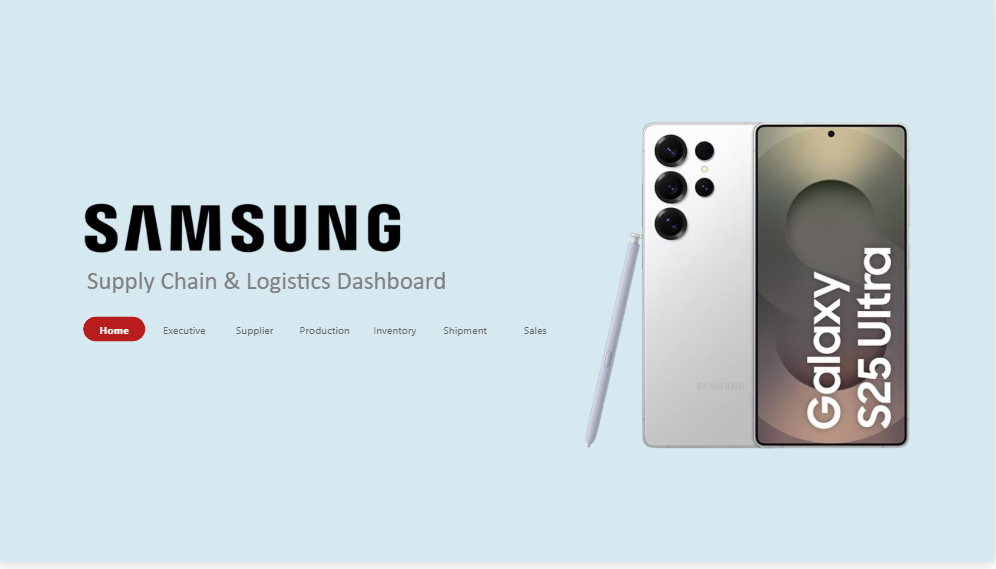
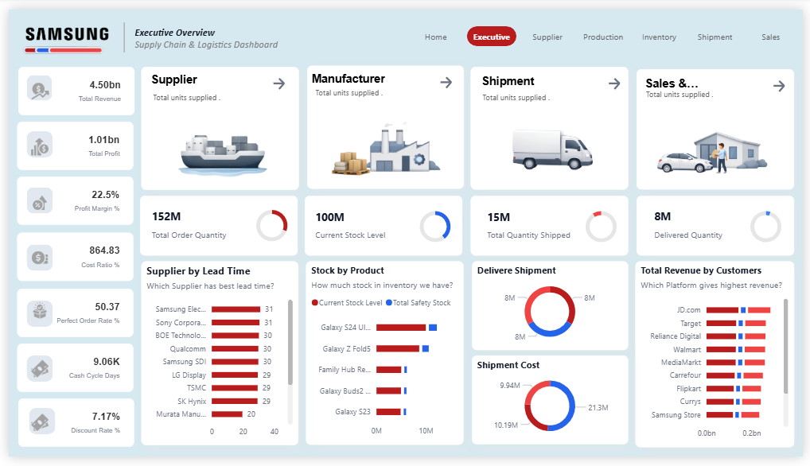
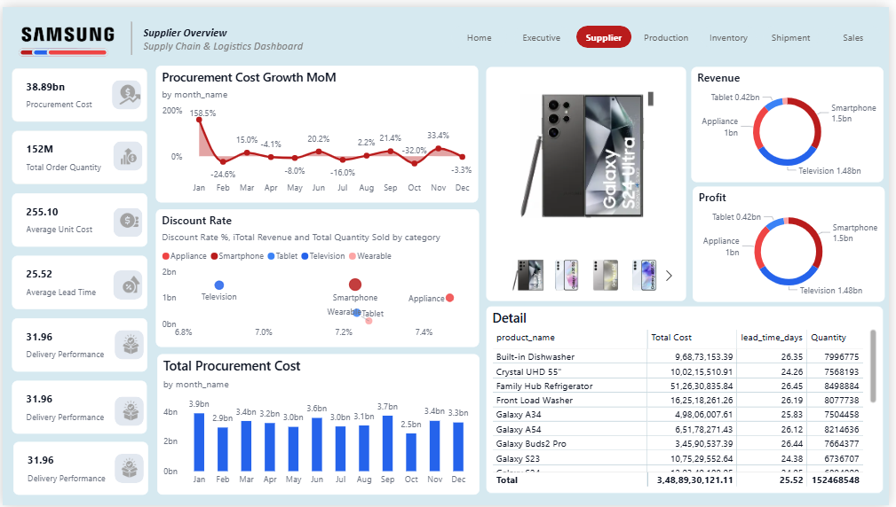
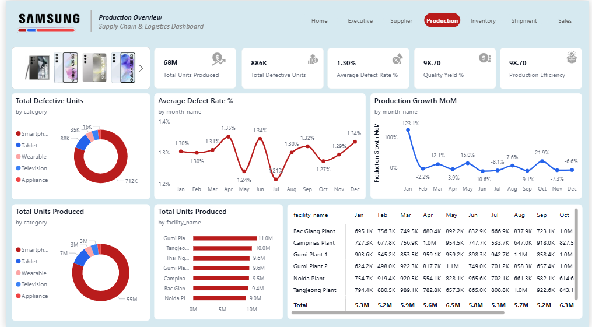
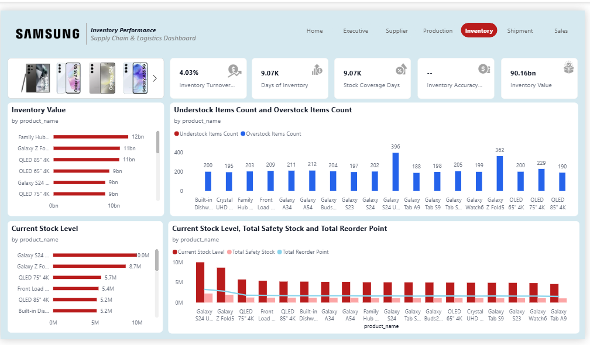
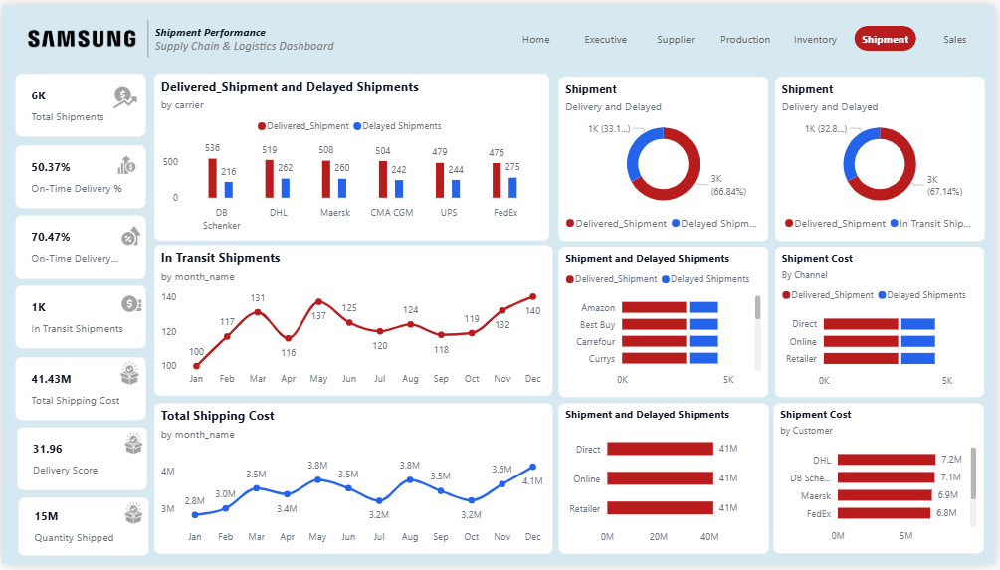
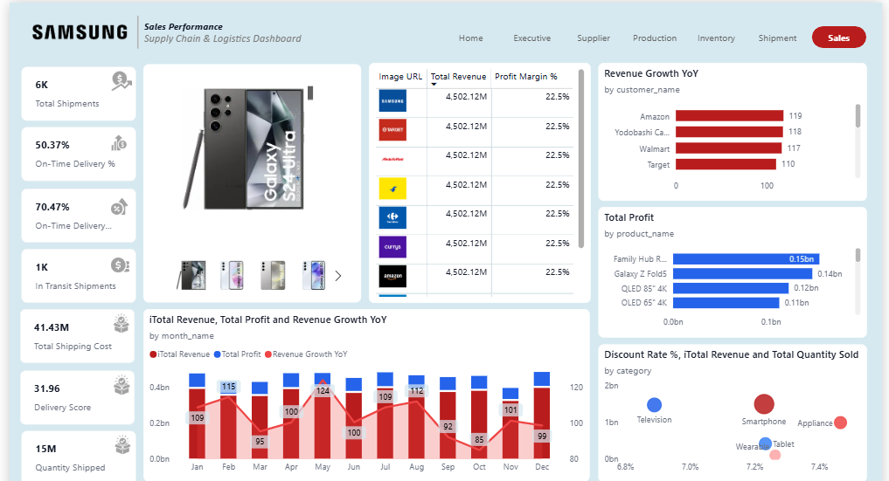

# 📊 Samsung Supply Chain Analytics Dashboard

🚀 Power BI | Data Analytics | Business Intelligence Project

---

## 🚀 Overview

This project is a **Supply Chain Analytics Dashboard** built using Power BI.

It analyzes:

* Sales
* Inventory
* Procurement
* Production
* Shipments

👉 Goal: Turn raw data into **clear business insights** for better decision-making.

---

## 🎯 Business Problem

Supply chains face challenges like:

* Delivery delays
* Inventory shortages
* Supplier inefficiency

This dashboard helps monitor and improve these areas.

---

## 🧠 Data Model

* Star Schema
* Fact Tables: Sales, Inventory, Procurement, Production, Shipment
* Dimension Tables: Customer, Product, Supplier, Facility, Date

---

## 📊 Dashboard Pages

---

### 🏠 Home

Simple landing page with navigation to all dashboards.

---

### 📊 Executive

**Focus:** Overall performance

**Insights:**

* Strong revenue (~4.5bn) and profit (~1bn)
* Supplier delays may impact operations
* Inventory mismatch indicates planning issues

---

### 🤝 Supplier

**Focus:** Procurement & suppliers

**Insights:**

* Some suppliers have higher lead time
* Procurement costs fluctuate
* Discounts reduce profit margins

---

### 🏭 Production

**Focus:** Manufacturing

**Insights:**

* Low defect rate (~1.3%)
* Some facilities show higher defects
* Monthly variation in production

---

### 📦 Inventory

**Focus:** Stock management

**Insights:**

* Understock risk for key products
* Overstock increases cost
* Inventory imbalance exists

---

### 🚚 Shipment

**Focus:** Delivery performance

**Insights:**

* On-time delivery ~50% (needs improvement)
* Some carriers cause delays
* Shipping costs vary

---

### 📈 Sales

**Focus:** Revenue & profit

**Insights:**

* Few products drive most revenue
* Discounts impact profitability
* Seasonal trends visible

---

## 🛠️ Tools Used

* Power BI
* SQL
* Python (Pandas, NumPy)
* Excel

---

## ▶️ How to Use

1. Download `Samsung.pbix`
2. Open in Power BI Desktop
3. Explore dashboards

---

## 👩‍💻 Author

**Pournima Kamble**
Master’s in Computer Science
Data Analytics | ML | Data Engineering
